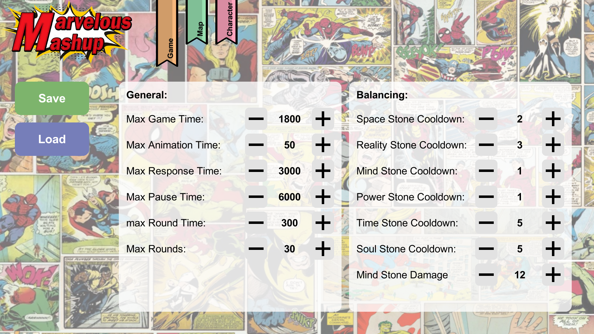
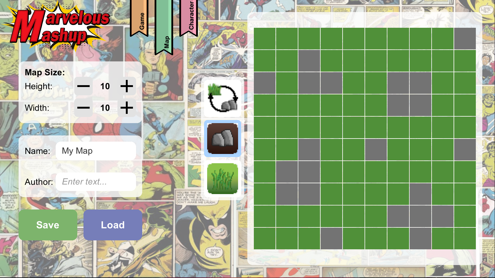
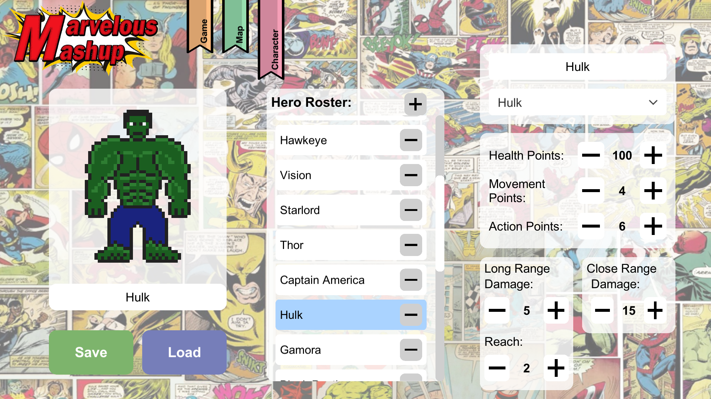

# Marvelous Mashup Editor

This is the Editor for the Game "Marvelous Mashup".

The project is part of the lecture "Softwaregrundprojekt" held at Ulm University.

This Editor has been created by Team 16.

**For more Information Checkout the whole [Projects Gitlab](https://gitlab.informatik.uni-ulm.de/sopra/ws20-marvelous-mashup/teams/team16).**

You can also checkout the Guidlines for the Project:
* [Standard Document on Gitlab](https://gitlab.informatik.uni-ulm.de/sopra/ws20-marvelous-mashup/standard)
* [Standardization Commitee Discord Server](https://discord.gg/aurEVPJv5y)

## Unity

**The project uses [Unity](https://unity.com/) as a Game-Engine.**

The leading platform for creating interactive, real-time content Build 2D, 3D and VR games and apps at speed. From artist tools to LiveOps – Everything you need to bring your vision to life today.

**The Code is written in [C#](https://docs.microsoft.com/de-de/dotnet/csharp/tour-of-csharp/)**

From Microsofts intro:

> C# (pronounced "See Sharp") is a modern, object-oriented, and type-safe programming language. C# enables developers to build many types of secure and robust applications that run in the .NET ecosystem. C# has its roots in the C family of languages and will be immediately familiar to C, C++, Java, and JavaScript programmers. [...]

### **External libraries**

**We are parsing objects to and from json strings with [Newtonsoft Json](https://www.newtonsoft.com/json/help/html/T_Newtonsoft_Json_JsonConvert.htm)**

**For opening a window to select a file location we incorporate [Unity Standalone File Browser](https://github.com/gkngkc/UnityStandaloneFileBrowser) into our project.**

## Images

The Editor contains 3 different Editors for each the Character, Map and Config Editor. These are shown below:

### Config Editor

### Scenario Editor

### Character Editor

## Creators

* **Developer**
  * Philipp Letschka
  * Cornelius Huber
  * René Müller
---

* **Artists**
  * Enrique Rempp
---

* Tutor
  * Jakob Meyer-Hilberg
  * Florian Ege
  * Thomas Thüm
