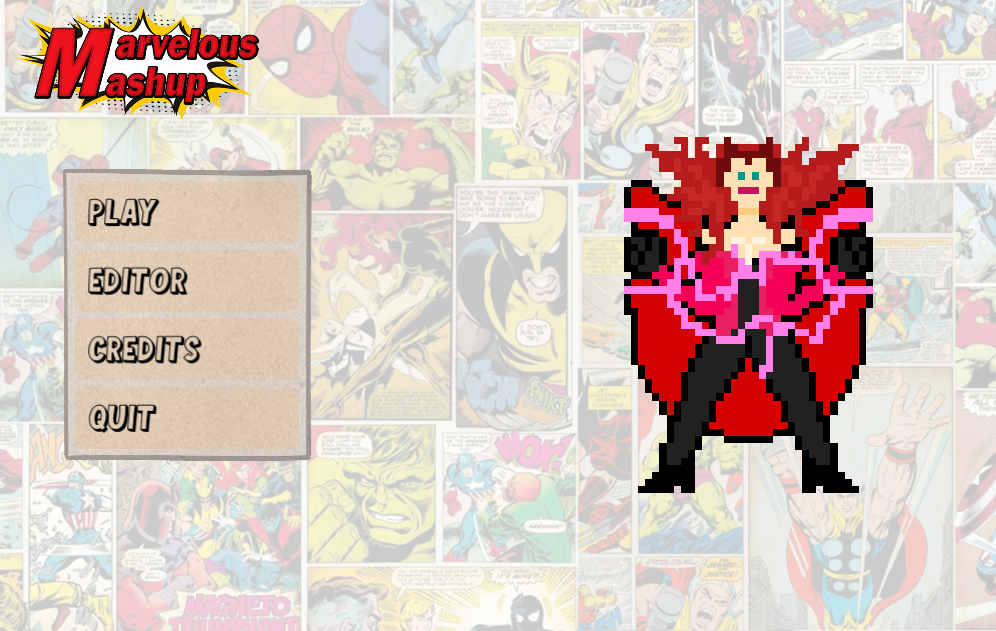
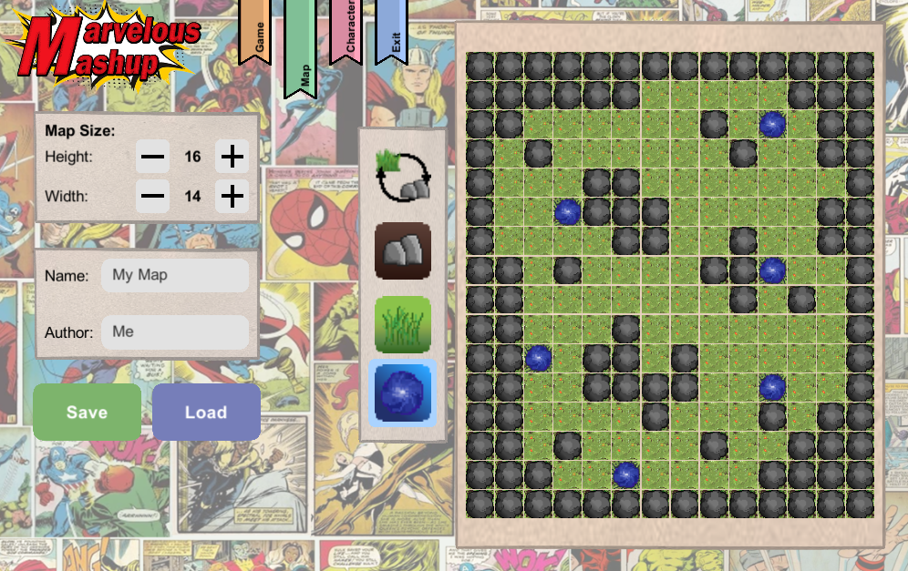
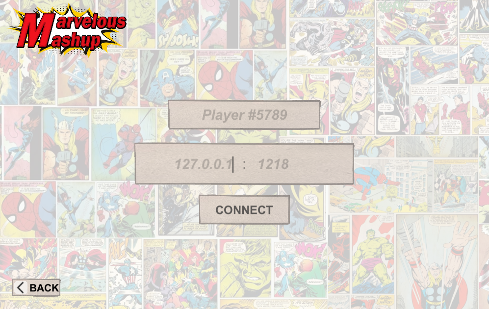
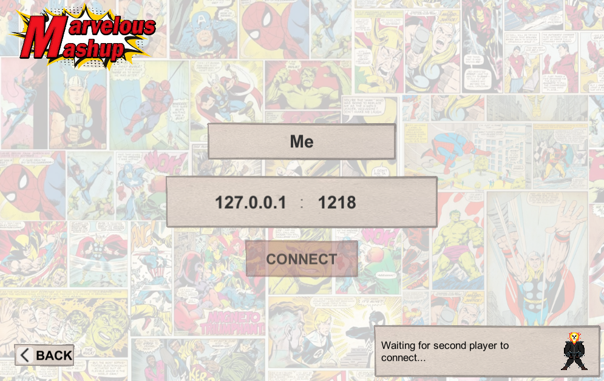
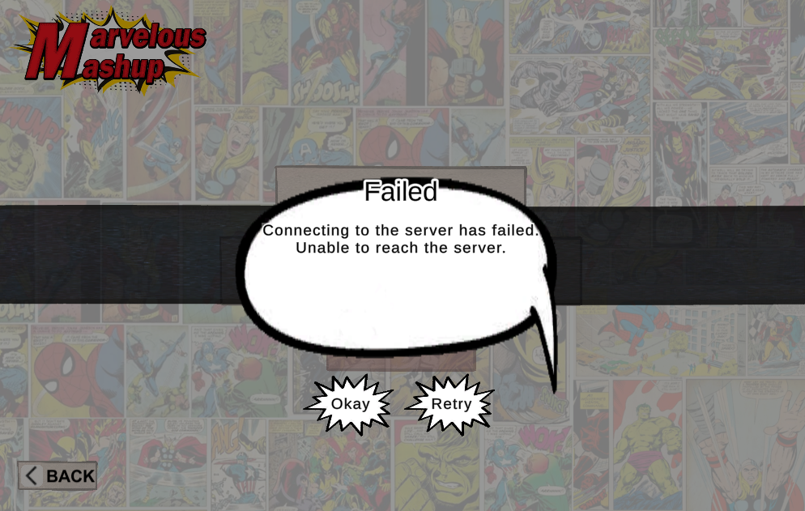
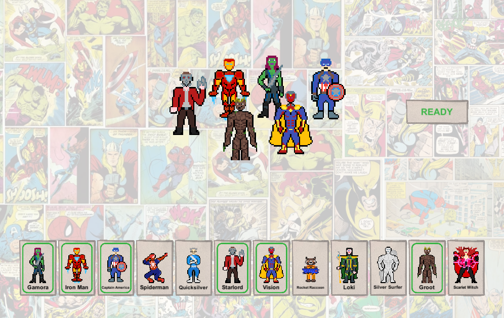
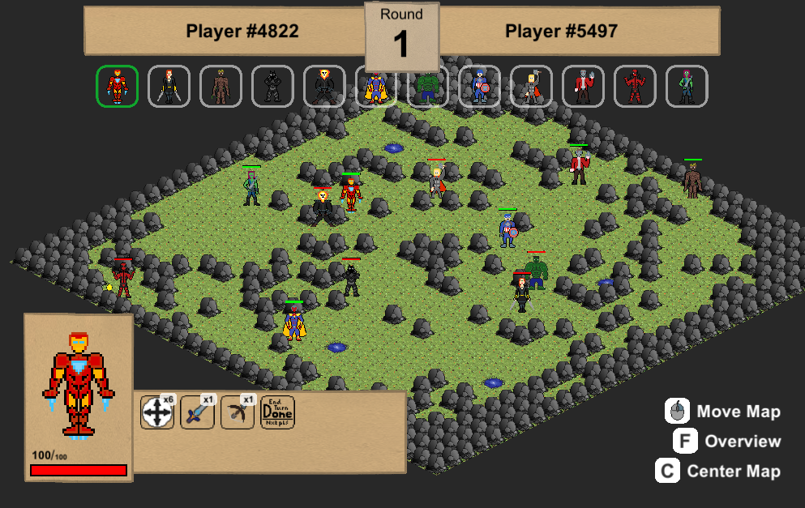
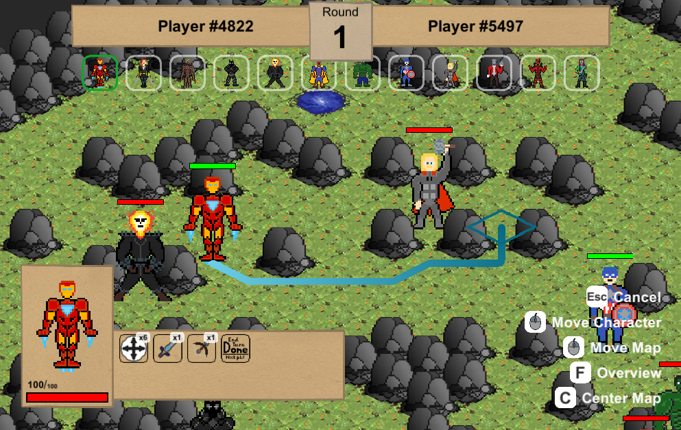
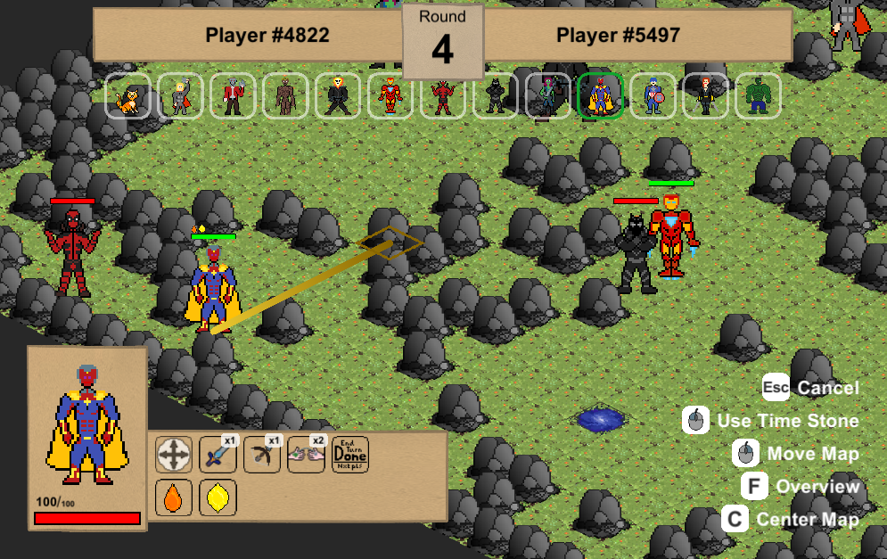
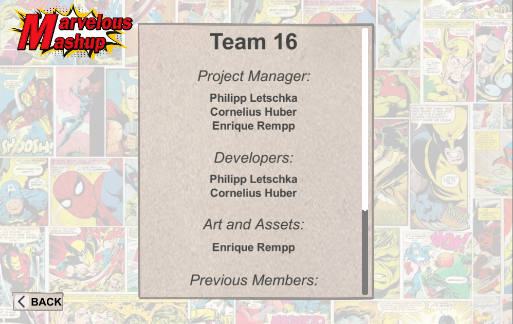

# Marvelous Mashup Editor

This is the Client for the Game "Marvelous Mashup".

The project is part of the lecture "Softwaregrundprojekt" held at Ulm University.

This Client has been created by Team 16.

**For more Information Checkout the whole [Projects Gitlab](https://gitlab.informatik.uni-ulm.de/sopra/ws20-marvelous-mashup/teams/team16).**

You can also checkout the Guidlines for the Project:
* [Standard Document on Gitlab](https://gitlab.informatik.uni-ulm.de/sopra/ws20-marvelous-mashup/standard)
* [Standardization Commitee Discord Server](https://discord.gg/aurEVPJv5y)

## Unity

**The project uses [Unity](https://unity.com/) as a Game-Engine.**

From Unitys intro:

> The leading platform for creating interactive, real-time content Build 2D, 3D and VR games and apps at speed. From artist tools to LiveOps – Everything you need to bring your vision to life today.

**The Code is written in [C#](https://docs.microsoft.com/de-de/dotnet/csharp/tour-of-csharp/)**

From Microsofts intro:

> C# (pronounced "See Sharp") is a modern, object-oriented, and type-safe programming language. C# enables developers to build many types of secure and robust applications that run in the .NET ecosystem. C# has its roots in the C family of languages and will be immediately familiar to C, C++, Java, and JavaScript programmers. [...]

### **External libraries**

**We are parsing objects to and from json strings with [Newtonsoft Json](https://www.newtonsoft.com/json/help/html/T_Newtonsoft_Json_JsonConvert.htm)**

**For opening a window to select a file location we incorporate [Unity Standalone File Browser](https://github.com/gkngkc/UnityStandaloneFileBrowser) into our project.**

## Images

### Main Menu

The Game starts with the Main Menu. You have the options to play a Game, open the Editor, show the Credits or end the application.
By selecting one of the first 3 elements you will be move to the appropriate scene. The last element closes the window

### Editor

The Client contains the Editors for each the Character, Map and Config Editor. An example state is shown below:

### Join Menu

If you select the Play option in the Main menu, you will we provided with this scene. Here you can enter you Server IP and Port, you want to connect to. You can also choose a Username as you wish.
By pressing "Connect" you are getting connected to the server. You will now have to wait for a second player connecting. Currently playing against an Ai is unsupported, also specating is not possible.
If the server is not reachable, the Connecting is canceled after 10 seconds.

### Character Selecting

When 2 Players are connected to the server, both get prompted with the character selection scene. Here they can choose 6 out of 12 characters. 

### Game

After both players selected their characters, the Game starts. For more Information on the game, you should probable try it out!!! A compiled .exe is found here: [MarvelousMashup](Build/MarvelousMashupTeam16.exe)

### Credits 

The user can choose the view the credits from the main Menu.

## Creators

* **Developer**
  * Philipp Letschka
  * Cornelius Huber
---

* **Artists**
  * Enrique Rempp
---

* Tutor
  * Jakob Meyer-Hilberg
  * Florian Ege
  * Thomas Thüm
